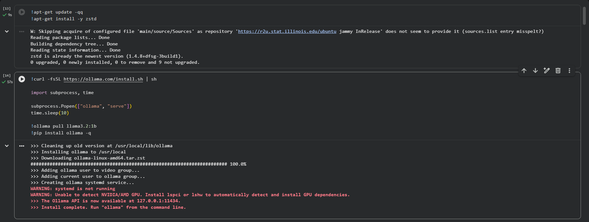
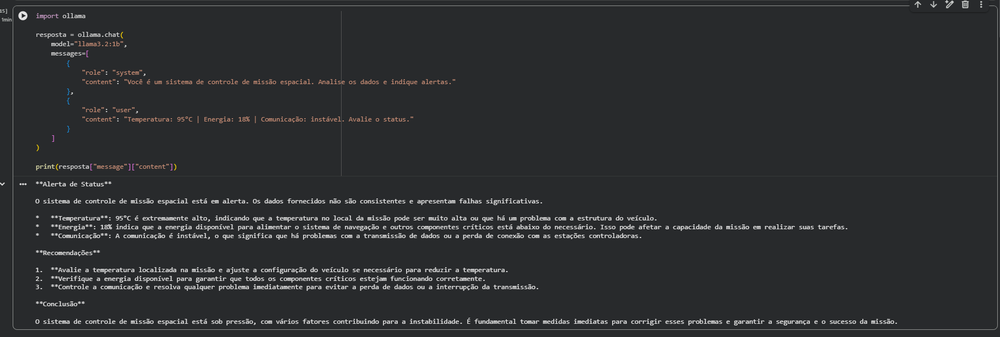
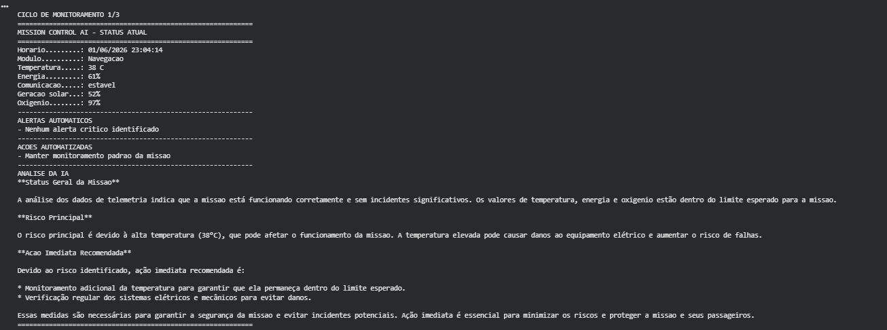
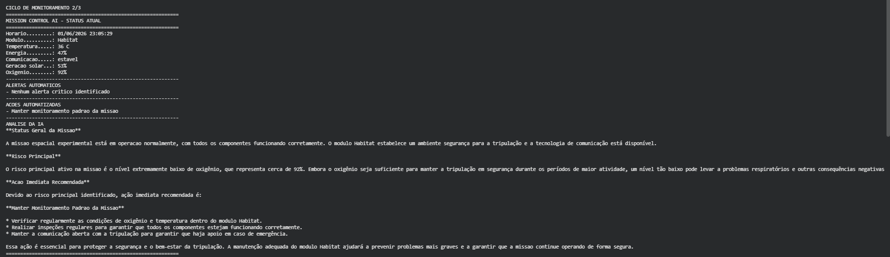
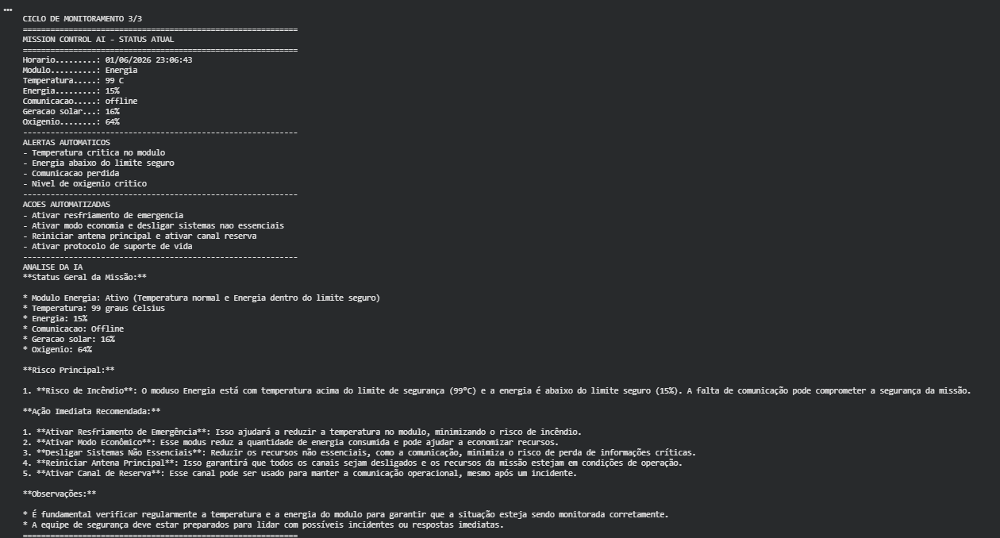

# Mission Control AI - Sistema de Monitoramento Espacial

**Integrantes:**
- Mauricio Bertuci Saletti - RM: 571229
- Leonardo Fortini Marcelo - RM: 572566
- Mateus Eduardo Da Cruz - RM: 570736

## O que o projeto faz

O Mission Control AI é um sistema em Python para monitoramento básico de uma missão espacial experimental. Ele gera dados simulados de temperatura, energia, comunicação, geração solar, oxigênio e módulo operacional.

A solução usa IA generativa com o modelo Llama via Ollama para analisar a telemetria, interpretar alertas e recomendar ações imediatas para a equipe de controle da missão.

## Funcionalidades

- Geração automática de dados simulados da missão.
- Monitoramento de pelo menos 3 parâmetros: temperatura, energia e comunicação.
- Monitoramento extra de geração solar, oxigênio e módulo operacional.
- Alertas automáticos para situações críticas.
- Lógica de tomada de decisão, como ativar modo economia quando a energia fica abaixo de 20%.
- Resposta automatizada da IA para análise do status geral da missão.
- Exibição clara dos dados no terminal ou Google Colab.

## Tecnologias utilizadas

- Python 3
- Google Colab
- Ollama
- Llama 3.2 1B
- Biblioteca `ollama`

## Demonstração









## Como executar

Abra o notebook no Google Colab:

[Acessar Notebook](https://colab.research.google.com/drive/1aaZb0vJqSVI3qRYQ0acSHfSd-HFQjCY7?usp=sharing)

Execute as células em ordem. O modelo Llama será instalado automaticamente pelo notebook.

## Vídeo de Demonstração

[Assistir ao vídeo](https://youtu.be/dkIKVL6x8L4)

## Estrutura do projeto

```text
mission_control_ai/
├── entrega.txt
├── mission_control_ai.ipynb
├── mission_control_ai.py
├── README.md
└── assets/
    ├── 01InstalandoInicializandoOllama/
            ├── 01instalando.png
            ├── 02iniciando.png
    ├── 02Executando
            ├── 01CicloMonitoramento.png
            ├── 02CicloMonitoramento.png
    └── 03TestesCenarios/
            ├── 01cenarioCritico.png
            ├── 02CenarioNormal.png 
```

## Observação

Caso o Ollama não esteja disponível no ambiente local, o projeto possui uma análise local de fallback para permitir testes da lógica de alertas e tomada de decisão. No Google Colab, recomenda-se executar a instalação do Ollama conforme as células do notebook.
